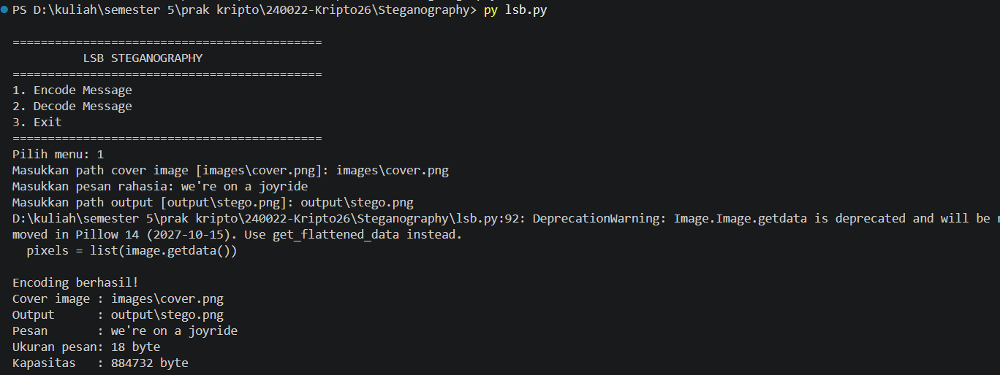
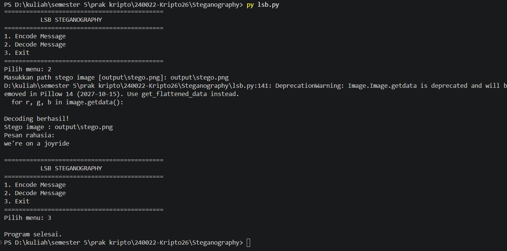

# LSB Steganography

Program steganografi berbasis Python yang menggunakan metode **Least Significant Bit (LSB) Sequential** untuk menyembunyikan pesan teks ke dalam citra RGB.

## Identitas

* **Nama:** Ibnaty Farah Rabbany
* **NPM:** 140810240022
* **Mata Kuliah:** Kriptografi
* **Pertemuan:** 02
* **Algoritma:** Hill Cipher
* **Bahasa Pemrograman:** C++

---

## 1. Deskripsi

Program ini menerapkan konsep steganografi digital dengan menggunakan sebuah citra sebagai **cover-object** untuk menyembunyikan pesan rahasia.

Metode yang digunakan adalah **LSB Sequential**. Bit pesan disisipkan secara berurutan pada bit paling rendah (*Least Significant Bit*) dari setiap channel RGB pada pixel gambar.

Program memiliki dua fungsi utama:

1. **Encode Message** — menyisipkan pesan ke dalam gambar.
2. **Decode Message** — mengekstraksi pesan dari gambar hasil steganografi.

Output encoding disimpan dalam format **PNG** agar data pixel yang telah dimodifikasi dapat dipertahankan.

---

## 2. Metode LSB Sequential

Pada citra RGB, setiap pixel terdiri dari tiga channel:

```text
R = Red
G = Green
B = Blue
```

Masing-masing channel memiliki nilai 8 bit.

Contoh:

```text
R = 10000010
G = 01111011
B = 01110101
```

Bit paling kanan merupakan LSB.

Program menyisipkan bit pesan pada LSB tersebut. Perubahan nilai channel maksimal hanya sebesar 1, sehingga perubahan visual pada gambar relatif kecil.

### Alur Encode

```text
Cover Image
     +
Secret Message
     |
     v
Konversi pesan menjadi UTF-8
     |
     v
Konversi byte menjadi bit
     |
     v
Tambahkan header panjang pesan
     |
     v
Sisipkan bit secara sequential
ke LSB channel R, G, dan B
     |
     v
Stego Image
```

### Alur Decode

```text
Stego Image
     |
     v
Baca LSB channel R, G, dan B
     |
     v
Baca header panjang pesan
     |
     v
Ambil bit pesan sesuai panjang data
     |
     v
Kelompokkan bit menjadi byte
     |
     v
Dekode UTF-8
     |
     v
Secret Message
```

---

## 3. Header Panjang Pesan

Agar proses decoding mengetahui berapa banyak bit yang harus dibaca, program menyimpan **header 32 bit** di bagian awal data.

Header tersebut menyimpan panjang pesan dalam satuan **byte**.

Struktur data yang disisipkan:

```text
[ 32-bit message length ][ message bits ]
```

Contoh secara sederhana:

```text
Header
  ↓
00000000 00000000 00000000 00010100
                                  ↓
                        panjang = 20 byte

Message
  ↓
01001000 01100001 ...
```

Dengan cara ini, decoder tidak perlu bergantung pada karakter khusus sebagai tanda akhir pesan.

---

## 4. Struktur Folder

Struktur folder mengikuti ketentuan tugas:

```text
Steganography/
│
├── lsb.py
├── requirements.txt
├── README.md
│
├── images/
│   └── cover.png
│
├── output/
│   └── stego.png
│
└── screenshots/
    ├── encode.png
    └── decode.png
```

Keterangan:

| File/Folder | Fungsi |
|---|---|
| `lsb.py` | Source code metode LSB |
| `requirements.txt` | Library Python yang diperlukan |
| `README.md` | Dokumentasi program |
| `images/cover.png` | Cover image sebelum encoding |
| `output/stego.png` | Hasil gambar setelah pesan disisipkan |
| `screenshots/` | Screenshot running program untuk dokumentasi tugas |

> `screenshots/encode.png` dan `screenshots/decode.png` diisi setelah program dijalankan.

---

## 5. Instalasi

Pastikan Python sudah terinstall.

Install library Pillow dengan:

```bash
pip install -r requirements.txt
```

Atau:

```bash
pip install Pillow
```

---

## 6. Menjalankan Program

Masuk ke folder project:

```bash
cd Steganography
```

Kemudian jalankan:

```bash
python lsb.py
```

Menu utama:

```text
============================================
          LSB STEGANOGRAPHY
============================================
1. Encode Message
2. Decode Message
3. Exit
============================================
Pilih menu:
```

---

## 7. Encode Message

Pilih:

```text
1. Encode Message
```

Kemudian masukkan:

```text
Masukkan path cover image [images\cover.png]:
Masukkan pesan rahasia:
Masukkan path output [output\stego.png]:
```

Contoh pesan:

```text
we're on a joyride
```

Jika berhasil:

```text
Encoding berhasil!
Cover image : images\cover.png
Output      : output\stego.png
Pesan       : we're on a joyride
```

File `output/stego.png` kemudian menjadi **stego-object** yang berisi pesan tersembunyi.

---

## 8. Decode Message

Pastikan `stego.png` sudah tersedia di folder `output`.

Pilih:

```text
2. Decode Message
```

Masukkan path:

```text
output/stego.png
```

Program akan membaca LSB dari gambar dan menampilkan pesan yang telah disisipkan.

Contoh:

```text
Decoding berhasil!
Stego image : output\stego.png
Pesan rahasia:
we're on a joyride
```

---

## 9. Screenshot Running Program

### 9.1. Screenshot Encode




### 9.2 Screenshot Decode




---

## 10. Keterangan Implementasi

Program menggunakan **1 bit LSB dari setiap channel RGB** secara sequential.

Dengan demikian, setiap pixel RGB dapat digunakan untuk menyimpan:

```text
1 bit pada R
1 bit pada G
1 bit pada B

Total = 3 bit / pixel
```

Kapasitas teoritis citra:

```text
jumlah pixel × 3 bit
```

Program juga menyimpan header 32 bit untuk menyimpan panjang pesan.

Pesan menggunakan encoding **UTF-8**, sehingga program dapat menangani karakter teks yang lebih beragam selama kapasitas gambar mencukupi.

---

## 11. Kelebihan dan Keterbatasan

### Kelebihan

- Implementasi sederhana dan mudah dipahami.
- Perubahan visual pada gambar relatif kecil.
- Proses encode dan decode dapat dilakukan dengan program yang sama.
- Menggunakan LSB Sequential sesuai dengan metode yang dipelajari pada praktikum.

### Keterbatasan

- Metode sequential lebih mudah dianalisis dibandingkan LSB dengan posisi pixel acak.
- Jika pixel gambar berubah, pesan dapat mengalami kerusakan.
- Output sebaiknya disimpan sebagai PNG untuk mempertahankan nilai pixel.
- Kapasitas pesan bergantung pada ukuran gambar.

---

## 12. Kesimpulan

Program ini menerapkan metode **Least Significant Bit (LSB) Sequential** untuk menyembunyikan pesan teks pada citra RGB.

Pada proses encoding, bit pesan disisipkan secara berurutan pada LSB channel Red, Green, dan Blue. Pada proses decoding, LSB yang telah disisipkan dibaca kembali untuk memperoleh bit pesan, kemudian dikonversi menjadi teks UTF-8.

Metode ini menunjukkan bagaimana pesan dapat disembunyikan di dalam sebuah citra dengan perubahan visual yang relatif kecil.
