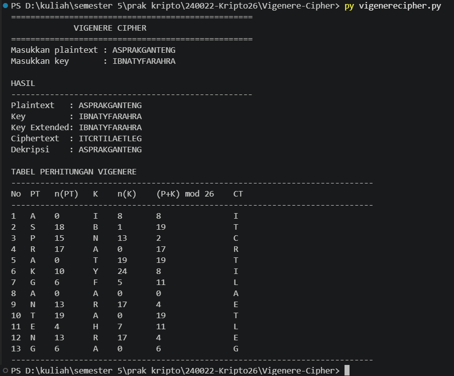

# Vigenere Cipher

Implementasi algoritma **Vigenere Cipher** menggunakan bahasa pemrograman Python. Program ini dibuat untuk memenuhi tugas praktikum Kriptografi Pertemuan 3.

## Identitas

* **Nama:** Ibnaty Farah Rabbany
* **NPM:** 140810240022
* **Mata Kuliah:** Kriptografi
* **Pertemuan:** 03
* **Algoritma:** Vigenere Cipher
* **Bahasa Pemrograman:** Python

---

## 1. Deskripsi

Program ini mengimplementasikan **Vigenere Cipher** secara modular menggunakan Python. Program menyediakan proses enkripsi, dekripsi, extended key, dan tabel perhitungan.

Indeks alfabet yang digunakan:
`A=0, B=1, ..., Z=25`

---

## 2. Rumus
Enkripsi:
`C = (P + K) mod 26`

Dekripsi:
`P = (C - K) mod 26`

---

## 3. Data Pengujian
```text
Plaintext : ASPRAKGANTENG
Key       : IBNATYFARAHRABBANY
```

Karena plaintext memiliki 13 karakter, key yang digunakan dalam perhitungan adalah:
```text
IBNATYFARAHRA
```

Hasil:
```text
Ciphertext : ITCRTILAETLEG
Dekripsi   : ASPRAKGANTENG
```
--- 

## 4. Tabel Perhitungan

| No | PT | n(PT) | K | n(K) | (n(PT)+n(K)) mod 26 | CT |
|---:|:--:|------:|:--:|-----:|---------------------:|:--:|
| 1 | A | 0 | I | 8 | 8 | I |
| 2 | S | 18 | B | 1 | 19 | T |
| 3 | P | 15 | N | 13 | 2 | C |
| 4 | R | 17 | A | 0 | 17 | R |
| 5 | A | 0 | T | 19 | 19 | T |
| 6 | K | 10 | Y | 24 | 8 | I |
| 7 | G | 6 | F | 5 | 11 | L |
| 8 | A | 0 | A | 0 | 0 | A |
| 9 | N | 13 | R | 17 | 4 | E |
| 10 | T | 19 | A | 0 | 19 | T |
| 11 | E | 4 | H | 7 | 11 | L |
| 12 | N | 13 | R | 17 | 4 | E |
| 13 | G | 6 | A | 0 | 6 | G |

--- 

## 5. Struktur Modular
```text
clean_text()
letter_to_number()
number_to_letter()
extend_key()
vigenere_encrypt()
vigenere_decrypt()
make_calculation_table()
print_calculation_table()
main()
```

--- 

## 6. Cara Menjalankan
```bash
python vigenerecipher.py
```

atau Windows:
```bash
py vigenerecipher.py
```

Kemudian masukkan:
```text
Masukkan plaintext : ASPRAKGANTENG
Masukkan key       : IBNATYFARAHRABBANY
```
---

## 7. Contoh Output
```text
Plaintext   : ASPRAKGANTENG
Key         : IBNATYFARAHRABBANY
Key Extended: IBNATYFARAHRA
Ciphertext  : ITCRTILAETLEG
Dekripsi    : ASPRAKGANTENG
```
--- 

## 8. Screenshot
### Screenshot Running Program


---

## 9. Kesimpulan
Program berhasil mengimplementasikan Vigenere Cipher secara modular. Enkripsi menggunakan `C=(P+K) mod 26` dan dekripsi menggunakan `P=(C-K) mod 26`. Dengan plaintext `ASPRAKGANTENG` dan key `IBNATYFARAHRABBANY`, diperoleh ciphertext `ITCRTILAETLEG`, kemudian ciphertext tersebut berhasil didekripsi kembali menjadi `ASPRAKGANTENG`.
